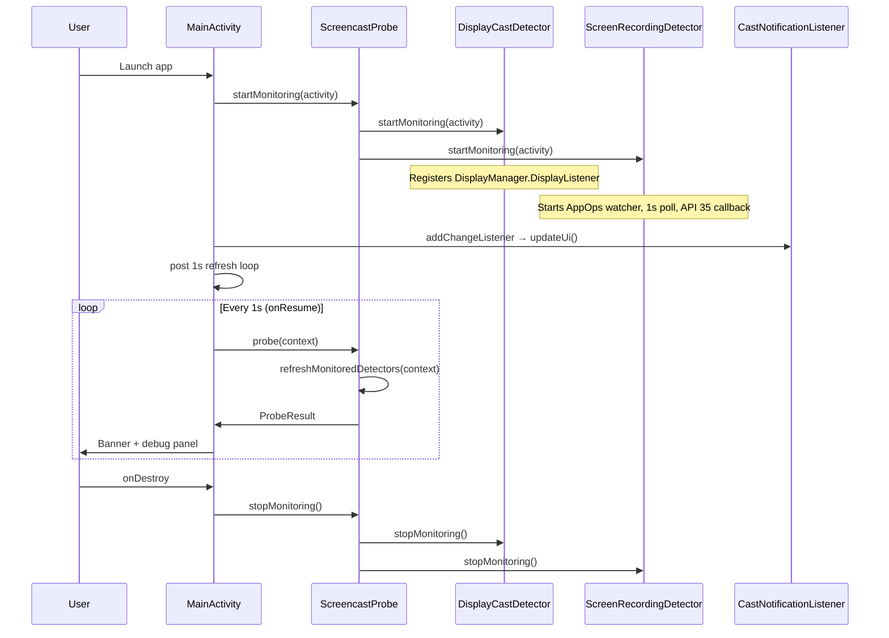
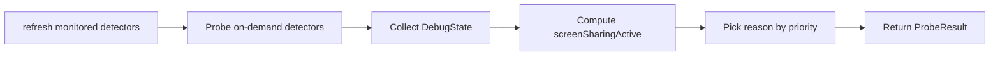
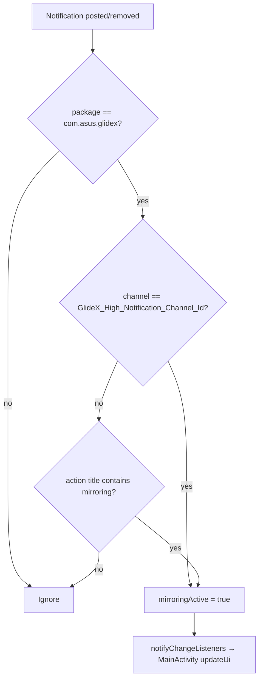
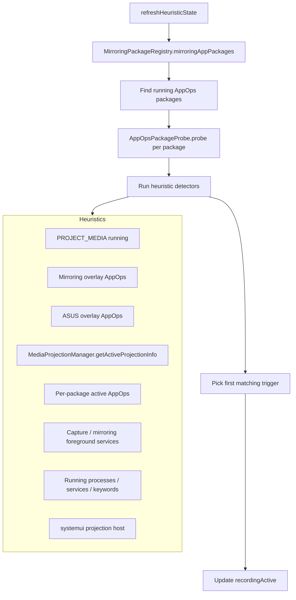
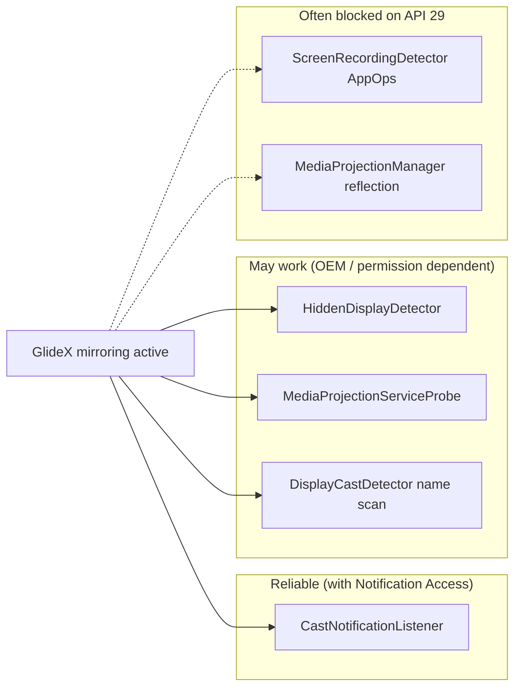

# ScreencastDetector — Current Implementation Flow

This document describes how the sample app detects screencasting / PC mirroring at runtime. It mirrors the code as of the current `ScreencastProbe` facade and its detector modules.

Target validation case: **ASUS GlideX on API 29**, where MediaProjection and AppOps are often hidden from third-party apps.

---

## High-level architecture

```mermaid
flowchart TB
    subgraph UI["MainActivity (debug UI)"]
        MA[onCreate / onResume]
        REF[1s auto-refresh + manual Refresh]
        NAL[CastNotificationListener change listener]
    end

    subgraph Facade["ScreencastProbe (facade)"]
        PROBE[probe(context)]
        REFRESH[refreshMonitoredDetectors]
        START[startMonitoring(activity)]
        STOP[stopMonitoring()]
    end

    subgraph Detectors["Detector modules"]
        DCD[DisplayCastDetector]
        HDD[HiddenDisplayDetector]
        MPS[MediaProjectionServiceProbe]
        CNL[CastNotificationListener]
        SRD[ScreenRecordingDetector]
        MRC[MediaRouterCastDetector]
    end

    subgraph Support["Shared helpers"]
        MPR[MirroringPackageRegistry]
        AOP[AppOpsPackageProbe]
        WF[WifiDisplayHelper]
        DBG[DebugReportFormatter]
    end

    MA --> START
    MA --> REF
    NAL --> REF
    REF --> PROBE
    PROBE --> REFRESH
    PROBE --> DCD & HDD & MPS & CNL & SRD & MRC
    PROBE --> DBG
    START --> DCD & SRD
    SRD --> MPR & AOP
```

**Entry point:** `MainActivity` calls `ScreencastProbe.startMonitoring()` once, then polls `ScreencastProbe.probe()` every **1 second** (and on notification-listener events).

**Combined result:** `ProbeResult.detected` is `true` when **any** display or screen-sharing signal is active. `ProbeResult.reason` picks the **first matching layer** in priority order (see [Reason priority](#reason-priority)).

---

## App lifecycle flow



### MainActivity responsibilities

| Phase | Action |
|-------|--------|
| `onCreate` | Inflate UI, wire Refresh / Notification Access buttons, call `ScreencastProbe.startMonitoring(this)` |
| `onResume` | Register `CastNotificationListener` change listener, start 1s `Handler` refresh loop, call `updateUi()` |
| `onPause` | Unregister notification listener, stop refresh loop |
| `onDestroy` | Stop monitoring via `ScreencastProbe.stopMonitoring()` |

`updateUi()` reads `ScreencastProbe.probe()` and sets:

- **Banner:** DETECTED (red) / NOT DETECTED (green)
- **Reason:** human-readable string from `ProbeResult.reason`
- **Debug panel:** full breakdown via `ScreencastProbe.formatDebugText()`

---

## Probe flow (`ScreencastProbe.probe`)

Each probe cycle runs in this order:



### Step 1 — `refreshMonitoredDetectors(context)`

Only detectors with background monitoring need a refresh before reading cached state:

- `DisplayCastDetector.refreshState`
- `ScreenRecordingDetector.refreshState`

On-demand detectors (`HiddenDisplayDetector.probe`, `MediaProjectionServiceProbe.probe`, `MediaRouterCastDetector.probe`) run fresh on every cycle.

### Step 2 — Collect per-layer debug state

| Layer | Source | Monitoring model |
|-------|--------|------------------|
| Display | `DisplayCastDetector.getDebugState` | Event-driven (`DisplayListener`) + refresh |
| Hidden virtual display | `HiddenDisplayDetector.probe` | On-demand each cycle |
| MediaProjection service | `MediaProjectionServiceProbe.probe` | On-demand each cycle |
| Notification listener | `CastNotificationListener.getDebugState` | Event-driven (`NotificationListenerService`) |
| Screen recording / PC mirror | `ScreenRecordingDetector.getDebugState` | Poll + AppOps watcher + API 35 callback |
| MediaRouter | `MediaRouterCastDetector.probe` | On-demand each cycle |

### Step 3 — Combine signals

```kotlin
screenSharingActive =
    recording.screenRecordingActive ||
    hiddenDisplay.hiddenVirtualDisplayActive ||
    mediaProjectionService.active ||
    notificationListener.mirroringActive ||
    mediaRouter.castRouteActive

detected =
    display.externalDisplayActive ||   // includes WiFi display via WifiDisplayHelper
    display.virtualDisplayActive ||
    screenSharingActive
```

### Reason priority

When `detected == true`, the **first** matching condition wins:

1. GlideX mirroring notification (`CastNotificationListener`)
2. MediaProjection service binder (`MediaProjectionServiceProbe`)
3. Private / hidden virtual display (`HiddenDisplayDetector`)
4. External display (`DisplayCastDetector`)
5. Visible virtual display (`DisplayCastDetector`)
6. Screen recording heuristics (`ScreenRecordingDetector`)
7. MediaRouter cast route (`MediaRouterCastDetector`)

---

## Detector modules (detailed)

### 1. `CastNotificationListener` — GlideX notification (API 29 primary path)

**Why:** On API 29, GlideX uses a private virtual display and hides MediaProjection/AppOps from third-party apps. The reliable signal is GlideX’s **“Stop mirroring”** notification.

**Requires:** Notification Access permission (`Settings.ACTION_NOTIFICATION_LISTENER_SETTINGS`).



**Manifest:** `CastNotificationListener` is declared as a `NotificationListenerService` with `BIND_NOTIFICATION_LISTENER_SERVICE`.

---

### 2. `HiddenDisplayDetector` — private virtual displays

**Why:** GlideX creates `GlideXVirtualDisplay` with `Display.FLAG_PRIVATE`, so it may not appear in `DisplayManager.getDisplays()` but still exists in the global display registry.

**Flow:**

1. Try `DisplayManagerGlobal.getInstance()` via reflection → enumerate display IDs → read `DisplayInfo` (type, state, owner, name).
2. Fallback: scan `DisplayManager` categories + brute-force display IDs `0..15`.
3. Flag active when a non-default **virtual** display (type 5) is `ON` and not owned by this app.

---

### 3. `MediaProjectionServiceProbe` — system MediaProjection binder

**Why:** `adb shell dumpsys media_projection` shows active sessions; this probe attempts the same via `IMediaProjectionManager.getActiveProjectionInfo()`.

**Flow:**

1. `ServiceManager.getService("media_projection")`
2. `IMediaProjectionManager.Stub.asInterface(binder)`
3. Reflect `getActiveProjectionInfo()` → `getPackageName()`
4. Active if package is non-null and not this app

May return `supported=true` but `active=false` on builds that block third-party access.

---

### 4. `DisplayCastDetector` — visible external / virtual displays

**Monitoring:** `DisplayManager.registerDisplayListener` while activity is alive.

**Threat checks per display:**

| Check | Condition |
|-------|-----------|
| External (API 30+) | Type `EXTERNAL` or `WIFI`, not off |
| Virtual (API 30+) | Type `VIRTUAL`, not `FLAG_PRIVATE`, not off |
| Presentation | Non-default presentation category display |
| Legacy (API 29) | Any non-default display that is on |
| Name heuristic | Display name contains `GlideX` or `VirtualDisplay` |

Also reads WiFi display status via [WifiDisplayHelper].

---

### 5. `ScreenRecordingDetector` — AppOps / process / service heuristics

**Monitoring started in** `ScreencastProbe.startMonitoring`:

| Mechanism | Interval / trigger |
|-----------|-------------------|
| 1s poll loop | `refreshHeuristicState` |
| AppOps active watcher | `project_media`, `system_alert_window`, `start_foreground` |
| API 35+ callback | `WindowManager.addScreenRecordingCallback` (reflection) |



**Detection triggers** (first match sets `detectionTrigger`):

| Trigger | Meaning |
|---------|---------|
| `appops_package_capture` | `AppOpsPackageProbe` sees capture combo on a mirroring package |
| `project_media_running` | Active `android:project_media` |
| `mirroring_overlay` | Overlay AppOp on known mirroring package |
| `asus_overlay` | Overlay AppOp on ASUS package |
| `dynamic_asus_overlay` | Overlay on dynamically discovered mirror-like package |
| `media_projection_info` | `MediaProjectionManager.getActiveProjectionInfo` |
| `mirroring_package_active_ops` | Active ops on registry package |
| `known_package_projection` | PROJECT_MEDIA on candidate package |
| `capture_service` | Running capture-named service |
| `mirroring_appops_combo` | Foreground + overlay/project_media combo (GlideX ignore workaround) |
| `mirroring_foreground_service` | Foreground mirroring service |
| `mirroring_process` / `mirroring_service` / `projection_process_keyword` | Process/service name heuristics |

**GlideX note:** PROJECT_MEDIA is often set to **ignore** on OEM builds. Detection falls back to **overlay + foreground** AppOps together (`AppOpsPackageProbe.isCaptureActive`).

---

### 6. `MediaRouterCastDetector` — cast route selection

Probes `MediaRouter.getSelectedRoute(ROUTE_TYPE_LIVE_VIDEO)`:

- Route is **not default**
- Playback type is **REMOTE**
- More than one route exists
- Route name suggests cast/mirror/glide/display

---

### 7. `MirroringPackageRegistry` — package discovery

Used by `ScreenRecordingDetector` and `AppOpsPackageProbe`:

- **Static list:** GlideX, Glide, PC Control, Samsung/Lenovo/Microsoft cast apps, Meet, Zoom, Teams, etc.
- **Dynamic discovery:** Installed packages whose names match keywords (`glide`, `mirror`, `cast`, `projection`, …)
- **Projection hosts:** `com.android.systemui`, `com.asus.systemui`

Cache invalidated when `ScreenRecordingDetector.startMonitoring` runs.

---

## GlideX on API 29 — expected detection path



**Recommended test setup:**

1. Grant Notification Access to ScreencastDetector
2. Start GlideX PC mirroring
3. Expect `mirroringActive: true` under **Notification listener (GlideX)** within ~1s
4. Reason: **GlideX mirroring notification**

---

## Debug output structure

`DebugReportFormatter.format()` (via `ScreencastProbe.formatDebugText()`) prints sections in this order:

1. App version, API level, last probe timestamp
2. Display (counts, WiFi, external, virtual)
3. Hidden virtual display (GlideX)
4. MediaProjection service
5. Notification listener (GlideX)
6. MediaRouter
7. Screen recording / PC mirror
8. Heuristic breakdown
9. Combined `detected` + `reason`

Log tag for native traces: **`ScreencastDetector`**

```bash
adb logcat -s ScreencastDetector:*
```

---

## File map

```
app/src/main/java/com/example/screencastdetector/
├── MainActivity.kt                — Debug UI, 1s refresh, notification access CTA
├── ScreencastProbe.kt             — Facade: probe / start / stop
├── DebugReportFormatter.kt        — Debug panel text builder
├── CastNotificationListener.kt    — GlideX notification listener service
├── HiddenDisplayDetector.kt       — DisplayManagerGlobal private display probe
├── MediaProjectionServiceProbe.kt — IMediaProjectionManager binder probe
├── DisplayCastDetector.kt         — External / virtual / presentation displays
├── ScreenRecordingDetector.kt     — AppOps, services, processes, API 35 callback
├── AppOpsPackageProbe.kt          — Per-package IAppOpsService.getOpsForPackage
├── AppOpsOps.kt                   — Shared AppOps constant names
├── WifiDisplayHelper.kt           — Shared WiFi display status check
├── MirroringPackageRegistry.kt    — Static + dynamic mirroring package list
└── MediaRouterCastDetector.kt     — MediaRouter remote route probe
```

---

## Integration note (OneApp)

If this sample detects GlideX but OneApp proctoring still reports “None Detected”, the gap is likely in the React Native bridge / system-check timing (`ProctoringOverlayModule`, `runSystemCheck.ts`), not in these native detector modules.
